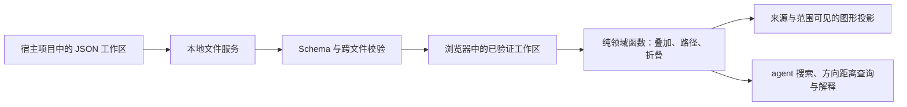

# Game-Graph架构设计

状态：2026-09-22。工作区为 v13，定义为 v7，规则库为 v1，机制为 v8，视图为 v5；查询协议与阅读合同以 `src/domain/query-contract.mjs` 为准。每个游戏项目固定使用 `.mechanics` 保存 canonical；`agentExportPath` 指向项目内按机制文件夹聚合的 Agent 文档。持久化领域对象使用英文语义 ID，概念支持基础/限定形态、自然语言 aliases、非语义 tags 和用户控制的 Agent 锁。CLI 只读查询与受约束 concept/rule mutation 和网页共用领域校验及保存队列。

## 问题、边界与不变量

工具为设计者和 agent 提供可追踪的规则模型。它独立于游戏引擎、资产编译器与宿主编辑器，用同一协议分析不同游戏。工具仓库保存通用程序、Schema、文档与虚构示例；具体游戏的工作区文件保存在游戏项目中。宿主通过 Git 子模块固定工具版本，不把分析数据搬入子模块。

影响边表达抽象规则层的正向、负向或随机影响；`specializes` 只表达具体概念到上位概念的单父分类（每概念至多一个父概念，禁止自连接与闭环）。路径方向不等于净效果或胜率。单入单出节点可折叠为摘要，但必须能展开回原始节点、边、说明及来源。叠加无覆盖优先级、无自动方向抵消、无按名称合并；当前缺边不代表实际规则中不存在关系。

统一节点定义图是每个工作区唯一的概念来源；基础规则与关卡的因果边仍归各机制图。概念表显示全部共享定义，机制图画布呈现所选图层的节点和边。无分析关系的定义节点不是坏设计。

## 新增或改变的概念、唯一 owner 与数据流

| 事实 | 唯一 owner | 消费者 |
| --- | --- | --- |
| 文件结构与枚举 | `schemas/protocol.schema.json` | AJV、文档作者、编辑器保存门禁 |
| 节点定义、别名、标签、Agent 锁与默认布局 | `definitions.json` | 所有机制图、定义总览 |
| 概念别名 | `definitions.graph.json` 的 `aliases` | 网页搜索、CLI 搜索、全局概念词典 |
| 基础/局面因果边、规则文字、局部布局 | 对应 `.mechanic.json` | 组合、路径与疑点计算 |
| 有序子机制注册、Visible、折叠、组合位置、`structuralPresentation` 与 `taxonomyPresentation` | 对应 view v5 `.view.json` | 最新源图只读投影；不拥有规则。机制 v8 同理持有单图的展示状态 |
| 工作区身份、唯一定义入口、保存的组合 | `workspace.json` | 文件服务、浏览器导航 |
| 分析文件成员与目录结构 | 工作区磁盘目录；服务生成内存 `files` 映射 | 保存服务、文件侧栏 |
| 重复 ID、工作区一致性、引用校验 | `src/domain/validate.mjs` | 文件读写门禁 |
| 叠加、路径、折叠、疑点 | `src/domain/graph.mjs` | 浏览器与 Agent 查询接口 |
| 视图注册解析、显隐变更与可见组合 | `src/domain/view.mjs` | 浏览器、校验、store 与 Agent 查询接口 |
| 端点限定词投影 | `src/domain/endpoint-projection.mjs` | 网页画布、自动排版与路由缓存；只创建读取模型，不写 canonical |
| is-a 展开与结构徽标的显示投影 | `src/domain/taxonomy-presentation.mjs` | 画布、布局、路由与几何签名的唯一显示投影入口 |
| Agent 阅读约定、查询语义版本 | `src/domain/query-contract.mjs` | guide 和所有查询输出 |
| 概念搜索、范围解析、方向距离、声明与推导输出 | `src/domain/query.mjs` | CLI 和本地 Agent 查询接口 |
| 语义 ID、别名归一化、端点规则 ID | `src/domain/identity.mjs` | 校验、网页创建与搜索 |
| 机制文件夹聚合投影、全局概念词典、semantic/document revision | `src/server/catalog.mjs` | 无 CLI Agent、版本库阅读、过期门禁 |
| canonical 目录、字节读取、版本戳 | `src/server/workspace.mjs` | 本地 HTTP、CLI、保存服务 |
| 单工作区锁、队列、原子替换与回读 | `src/server/store.mjs` | HTTP 保存与新建接口 |
| 根定位与初始化 | `src/server/workspace-commands.mjs` | CLI 与网页项目打开 |
| 包内受管 skill 与项目注册副本 | `skills/`、`src/server/project-skills.mjs` | `init`、网页打开/初始化后的后台同步、`mech sync`、`mech migrate-project` |
| 完整文件提交和锁文件 | `src/server/files.mjs` | 保存服务与迁移器 |
| 本机接口路由、CORS、Host 与请求合同 | `src/server/http.mjs` | 浏览器 |
| 机制/视图打开模式、当前草稿、撤销与返回上下文 | `src/web/app.mjs` | 页面；以服务回读确认保存 |
| 打开候选、展示位置、成员变更与失败暂停 | `src/web/view-files.mjs` | app 共享写入队列，不自建第二队列 |
| SVG 投影、相机与拖拽手势 | `src/web/canvas.mjs` | 页面；不拥有持久化事实 |
| 概念表格、引用候选、预检与提交阶段 | `src/web/glossary.mjs` | 编辑 app 草稿或窗口会话；由 app 注入保存与应用动作，不自行请求 API |

`src/domain/graph.mjs` 是纯函数模块，可直接在浏览器或 Node 中运行。文档结构校验使用 AJV，跨文件验证集中在同一入口，不在 UI 再造一套事实模型。`src/web/` 当前采用原生 ES 模块与 SVG；后续可更换交互框架或图形库，但不得让组件状态成为独立规则源。

canonical definitions 与 mechanics 是唯一可编辑语义真相。`agentExportPath` 目录根据二者及机制文件实际目录生成 catalog v5 的 `AGENTS.md`、`README.md`、唯一 `concepts.md` 和文件夹 Markdown；文件夹页只声明直接所属机制图，子目录只链接，概念词典按稳定 ID 锚点集中定义与反向引用。它不包含 positions、view、端口或路线，也不合成流程说明。几何和视图变化不改变文档。生成目录只读；Agent 写入只能使用 CLI 的 concept/rule mutation。

`ProjectContext` 明确区分 projectRoot、固定 workspaceRoot 与可配置 agentExportRoot。CLI 显式 `--project` 优先；省略时向上寻找最近的 `.mechanics/workspace.json`。`web` 可以空项目启动，再由网页原子打开或初始化项目。项目切换以 `projectGeneration` 隔离旧页面和在线 Agent 写入。工作区 v13 递归发现普通 `*.mechanic.json` 和 `*.view.json`；每次读取重建 `{kind,id?,path}` 映射，不持久化第二份清单。任何坏文件或断引用均整体失败，不返回部分成功；旧版本按兼容与迁移边界处理，受管工具目录 `.mechanics/tools` 不计入文件树版本。

每个分析文件在界面称为「机制」。点击机制打开单图，只允许编辑自身的规则和位置；点击视图打开只读组合，当前视图下只列它注册的子机制。Visible 只改当前投影，添加按钮从全局候选注册新子机制。全局机制目录继续负责单图打开、新建与筛选，不承担视图成员清单。视图中源规则只读，详情提供「编辑源机制」，进入单图后可「返回视图」。顶部概念表维护已有定义；机制引用窗口也能新增共享定义，二者写向同一文件。

页面只持有一份当前规则草稿；切换前要求保存、放弃或取消，规则与定义手动保存。视图模式不持有源规则草稿，注册、Visible、折叠和组合位置自动写视图。撤销随当前文件种类操作：规则形成手动草稿，视图再次自动保存。相机按文件在页面会话记忆，返回恢复，不落盘；普通点击和显隐切换不强制 fit。命名视图 lastView 只存 `{viewId}`；机制最近打开沿用单成员内联形式，折叠和位置为空。无最近记录只打开第一张机制。

旧多图或带展示状态的内联 lastView 不在启动时覆盖，显示只读预览，须明确保存成 view v5 或放弃。正式 view v5 不包含 `graphIds` 或 `activeLayerId`，以 `mechanicRegistrations: [{mechanicId, visible}]` 为唯一注册和显隐事实，并显式保存 `structuralPresentation` 与 `taxonomyPresentation`；源布局不抢占视图位置。旧 view 严格拒绝，不提供运行时兼容；历史 workspace compositions 保留原文与校验。

视图成员变化保留仍存在节点位置，仅清理失去引用的位置并展开不成立的折叠，合为一个可撤销动作。外部规则使保存的折叠失效时，先报错并提供明确展开修复，确认后才写视图；坏引用仍整体拒绝。机制删除可能破坏视图位置或折叠引用时，先列出受影响视图，保存仍由全工作区校验门禁阻止，不联动清理。

打开视图始终重新 GET 完整工作区，包括重复打开同一 ID。先验证候选叠加、折叠，再写最近打开记录，全部确认后才替换 UI 与规则草稿。失败保持原画面并明确标记未刷新；“放弃”决定延后至目标成功时生效。命名视图变化捕获明确的文件目标和快照，与规则写入共用队列；首次失败立即暂停后续自动写入，分开显示规则与视图状态，允许导出两类草稿。不采用外部新 revision 偷偷重试。

## 推荐决策、关键理由与一个关键失败路径

### 当前协议边界

Schema 只拥有文件形状与版本；domain 拥有基础/限定概念、`specializes` 单父分类（每概念至多一个父概念）、影响符号、继承策略和查询语义；server 拥有发现、版本、锁、预览、迁移与原子提交；web 只拥有交互草稿与投影，不能成为规则源。画布显示投影固定为两段：`src/domain/endpoint-projection.mjs` 先按规则端点限定词生成参与者范围投影，`src/domain/taxonomy-presentation.mjs` 再叠加 is-a 展开与结构徽标；两段都只读 canonical，不反写概念或关系。基础概念实例只在它的全部可见端点都已被限定投影接管时才不重复绘制；没有任何规则但属于当前焦点集合的概念必须保留，不得因为不在任何边上而从画布消失。`influence` 的 sign 为 `1`、`-1` 或 `"random"`，并必须显式声明 `inheritance:none` 或受限的 `specializeEndpoint`。

迁移是单一原子边界：每一跳（`v7→v8→v9→v10→v12→v13`）先全量读取与校验候选，再以预览 revision 显式提交并回读；失败、冲突和未知版本不产生部分升级。打开项目时所有仍有迁移路径的旧协议（v7–v12）自动按同一路径逐级升级，更早或未知的旧资料以只读兼容模式打开。查询中的 `declarations` 为已保存作者声明，`derived` 仅在显式请求继承时计算；派生不落盘、不级联，特化路径歧义与 qualifier 绑定冲突直接失败。配对型共性机制（例如“上限概念裁剪资源概念留存”）**不靠两端各自的 is-a 特化派生**——那会产生交叉配对；它由 `retentionBindings` 一等声明，并在显式请求时生成带 `origin` 的派生边。分类透传上下文与派生边都由 `src/domain/query-paths.mjs` 计算，`src/domain/graph.mjs` 只处理作者声明的边。视图只投影已保存的节点和关系，`structuralPresentation` 只决定 `line` 或 `badge` 呈现；is-a 的标签、虚线边与展开集合由 `taxonomyPresentation` 决定（投影 owner 为 `src/domain/taxonomy-presentation.mjs`），两者都不改变结构或推理。

### 0.6.0 引用窗口内新建

复用现有引用入口，在同一窗口搜索和填写。单个新概念使用「创建并引用」，批量使用「加入待选并继续」；名称从搜索词带入，名称与概念定义必填。已有引用不从结果中消失，而是标记且禁选；同名列表引导复用，明确确认后才允许独立 ID。搜索 Enter 仅勾选结果，组合输入的 Enter 不触发提交。

app 持有一个 referenceSession，包含目标机制、已有选择、待新建概念和提交阶段；它是窗口临时输入，不是第二份共享定义草稿。取消提交前会话不改文件或机制。预检从最新已读定义与现有机制草稿组装候选，明确检查必填、稳定 ID、引用和可组合性，并先计算新位置。复用整体 revision 和串行 write，只保存定义文件；确认成功后一次 edit 加入全部引用，保留原机制草稿、baseline 和历史。已有概念引用不经过定义写入，机制仍手动保存。撤销只恢复机制，不跨文件删除已保存定义。

ReferenceCommit 区分保存中、应用中、完成、失败、结果待确认和已保存未应用。失败暂停再次创建；显式读取后比较原持久化机制、候选 ID 和完整内容：全部已落盘则只继续引用，全部未落盘则保留外部最新定义并等待用户再次提交，部分或不同内容拒绝继续。机制已外部改变也拒绝自动合并。窗口关闭后保留失败会话并限制切换；导出可同时保留原草稿、候选和计划引用，明确结束只移除会话，不删除已写入定义。重读、提交失败不替换原机制草稿，不声称两文件原子成功。

新位置写入当前机制 positions，围绕相机中心寻找不重叠空位；既有节点的隐式位置按文件在页面记忆，定义排序变化不重排原图。新增后选中新节点但不 fit；大批量可能超出可见区域。没有新 Schema、HTTP 路由或数据迁移，继续使用现有定义保存接口。服务逐请求读取静态资源，更新后刷新即可加载，不需重启会话。

验证包含真实 store 的定义单文件写入、响应丢失后核实、revision 冲突和外部新增保护、应用失败不重复创建，以及引用预检和稳定布局；浏览器验证实际填写、取消、同名确认、混合批量、一次撤销、保存重开、必填校验、冲突关闭重开恢复和视图只读。组合输入有事件保护，但未进行真实中文输入法候选上屏验收；不能据此声称全平台 IME 通过。

### 0.5.1 侧栏投影

视图列表固定在机制前面；机制按实际路径生成可折叠目录，只保留包含匹配文件的路径。查询匹配机制名称、稳定 ID、相对路径，搜索临时展开祖先目录，清除恢复原折叠。`app.mjs` 的 sidebarState 独立拥有查询文本、机制区折叠和目录折叠集合；不进入 viewSnapshot、lastView、撤销记录或保存队列，不复用图节点折叠。

持久 DOM 保留搜索框和区标题，仅替换文件列表，避免输入重绘丢失焦点。已选数量取当前视图完整成员，不按匹配结果计数。新机制沿用创建后独立打开的流程，成功后清除筛选并展开自身路径，不自动加入原视图。创建已成功但打开失败仍报告已创建路径，不重复创建或隐式回滚。两区标题旁的加号只创建对应类型；存为视图/另存为移到画布上方，旧叠加保存入口和保存失败门禁保留。

此改动只涉及既有静态页面，无新 HTTP 路由、Schema、文件移动或迁移。已有服务按请求读取静态文件，可在更新代码后刷新页面，不必为样式改动重启会话。

### 2026-09-01 单向中性影响（历史，已被 2026-09-02 修订替代）

用户在复核宏观战斗图后决定将等号改为单向：所有关系只沿 source → target 传播；等号在路径任意位置均不改变正负号，不隐式反向、跨共同汇点或共同来源扩散。仍允许显式有向闭环，不恢复早期“只能细化目标、不能从等号起步”的限制。网页箭头、路径说明、下游候选和 CLI 邻域共同遵守此规则，Agent 的 semanticsVersion 改为 directed-neutral-1。文件结构不变；双向时期创建的方向由用户核对，不自动复制成双边。此节替代下方所有历史双向约定。

### 2026-09-01 双向宏观影响与连线（历史，已被上述修订替代）

用户明确修订等号为双向宏观影响传递：旧 v2 contains 结构保持，但不再限制父子传播方向。domain 在内存展开两向遍历，正负边仍单向；等号在路径任意位置不改变正负号。反向步骤保存原始来源并附 traversalSource/traversalTarget，路径解释使用实际遍历次序。闭环允许，简单路径与数量/深度上限防止无限遍历；只拒绝包含自连接。不计算禁止、具体效果或数值，不写派生关系。此节取代下方历史单向语义。

app 拥有本页最近成功创建/修改的关系类型（初始促进）；canvas 拥有双击候选与连接源。双击只进入连接，单击目标沿同一 edit 门禁创建，失败保留源，成功退出；取消与文件切换清理临时状态。四边端点自动计算、同节点对固定法线错开并行边，仅为展示，无新增协议字段。机制手动保存、视图规则只读不变。

### 0.5.0 包含推理与多选（历史语义，已由上述修订替代）

机制 v1 在同一 edges 集合区分 influence 与 contains，包含禁止携带 sign。父类 → 子类的黄色等号不改变路径符号；所有关系按 source → target 单向传播。只有包含步骤的路径没有正负号。来源、条件和说明仍保留，不物化持久化继承闭包。

`graph.mjs` 拥有包含校验和推导；单机制在读写时检查包含环，选图组合在 compose 时检查跨图环。视图写入也检查当前组合，但不把所有未选机制合成全局分类；源机制仍可单独打开修正。查询用未折叠 original，包含相邻节点不能折叠。诊断区分包含与作用，不把仅包含节点报为作用终点。

v1 内存投影补充明确的 influence 类型但不改原文；普通编辑保持 v1，首次包含才升级当前草稿并提示，手动保存才落盘。新机制为 v2，保存后的 v2 不自动降级；其他文档不重写。严格 Schema 拒绝未知类型、contains 带 sign、influence 缺 sign 与未知版本。

选择集合属于 app 会话，矩形与位移预览属于 canvas；右键空白框选、Shift 增减、整组拖动只在松手提交一次位置映射。共同 delta 限制边界保持队形；取消/失焦/失捕获不保存，手势期间不缩放。机制写 draft.positions 并手动保存，视图写快照 positions 并自动保存；撤销恢复整组。包含环候选先验证再替换草稿；叠加失败复原复选框。

0.5.0 新增 9 项自动化用例覆盖正负继承、反向/兄弟/源端禁止、纯包含、来源、多父类、版本互斥、实际单文件升级、包含环、缩放后的反向框选、群组提交、取消与共同边界。隔离浏览器验证黄色连线、升级撤销与保存、抑制路径、Shift 多选、机制整组拖动和一次撤销、视图自动保存/撤销/重做/重开、包含环拒绝及外部 revision 冲突暂停。视图操作前后四份源机制 SHA-256 一致。右键框选由实际 canvas 手势方法自动化验证；浏览器拖拽验收使用 Shift 多选后的左拖，不将其声称为浏览器右键拖拽验收。

### 本地文件优先

采用 Node.js 24+、普通浏览器与本地 UTF-8 JSON。没有云数据库、浏览器私有数据库或宿主专用 host。本地服务器只绑定 `127.0.0.1`，没有 session、Bearer 或 Origin 授权，并显式允许跨源 JSON API。任何能访问本机端口并知道项目绝对路径的网页或进程都可能调用写接口，因此只用于可信本机开发环境。API 仍校验 Host、Content-Type、项目代次、revision、路径和锁，不执行模型文本。

文件读取限定到固定根，逐层拒绝内部符号链接/junction，拒绝绝对路径、`..`、重复路径、嵌套工作区和无效引用。隐藏条目与 node_modules 排除；其他普通 JSON 不作为图解析。静态资源按白名单提供，不开放目录；单文件上限 2 MiB、机制图/视图各 300 张、目录深度 24、可见目录项 10000。此边界针对浏览器越权和误操作，不防御同权限恶意本机进程。

JSON Schema 采用 draft-07，由 AJV 严格校验，不开启类型转换、默认填充或删除额外字段；协议版本与 JSON Schema 草案版本是两个不同概念。[AJV 对 Schema 草案的支持](https://ajv.js.org/json-schema.html#draft-07-default)

### 保存入口内部执行门禁

保存服务使用工作区单写进程锁、串行队列、**按资源的 revision 比较**、候选工作区引用校验、同目录临时文件及原子替换、回读确认。定义删除检查全部持久化图，不仅当前显示的图。多标签页同时使用时，旧 projectGeneration 必须拒绝；旧 revision 只在本次写入真正涉及的资源已经改变时拒绝，其他资源的写入不再阻塞它。版本戳与每资源版本都剔除展示字段，因此打开图补算坐标与连线路径不会作废其他页面或 Agent 草稿。

本机锁通过独占创建 `.mechanics.lock` 获取，只覆盖写事务；服务队列串行处理本进程请求，网页打开不长期占锁。离线草稿工具与网页/CLI 共用该短事务锁，不另设写锁。锁文件记录持有进程，确认进程已退出时可回收死锁；活跃或无法确认的锁仍拒绝写入，不手动删除未知锁。一次操作失败只终止该请求，不隐式重试；后续独立请求仍可进入队列。

新建图以同目录完整临时文件加硬链接发布，原子拒绝同名目标；不再另改 manifest。文件完整出现即属于目录发现集合。创建父目录后失败可能留下空目录，须报告目标与失败；不支持硬链接的文件系统明确失败。已有文件以 rename 替换；提交后回读或响应失败返回“结果待确认”，不能声称没写入或自动重放。

创建视图文件和更新最近打开是两次提交；前者成功、后者失败时报告已创建路径并要求重读，不能假称整体回滚、自动重建或删除。视图与机制图采用同一受限提交机制，只把种类、后缀和文档集合参数化。

安装包的 bin、静态资源、Schema 与 `skills/` 相对模块地址定位，与资料目录分离；产品以公开 npm 包 `@veewo/mechanics` 分发，发布版本由 `package.json` 管理。CLI 与服务只把 Game-Graph workspace v13、definitions v7、rules v1、mechanic v8、view v5 及正式后缀当作可写合同；v7–v12 在创建 store 前由 project-manager 逐级预览→执行自动升级，任何一跳失败都零部分写入，更早或未知的旧资料仅以核心拓扑兼容模式只读打开。逐级显式迁移（v7→v8→v9→v10→v12→v13）始终可用，`mech migrate-project` 负责旧根、旧 skill 与协议的一次链式升级。三个受管 skill（`mechanics-search`、`mechanics-modeling`、`mechanics-doc`）的唯一维护源在包内，`init`、网页打开或初始化后的后台同步与 `mech sync` 把注册副本写入项目 `.agents/skills/`；内容不同或含过期附件时以安装包完整目录替换，只有普通文件或符号链接占用路径才返回 `PROJECT_SKILL_CONFLICT`，不静默覆盖非受管路径。详见 [CLI 与工作区](CLI与工作区.md)。

离线工具的维护源为 `src/tools/workspace-tool-source.mjs`，`npm run build:workspace-tool` 把 Schema、domain 校验和所需安全 I/O 构建为 `workspace-tools/workspace-tool.mjs` 单文件；项目注册副本仍只需要 Node，不在运行时依赖安装目录、CLI 或 HTTP。`check` 与 `check:package` 检查产物是否与源一致。默认打开草稿、编辑相关内容后直接 `draft save`；保存候选合入最新的全部机制/视图与清单引用，结构化诊断定位资源/字段/ID。`draft validate` 仅复用同一提交前门禁做 dry-run，不能代替 save 在最新基线上的检查。只读查询不加载视图，视图内容不进入查询 revision；它保留共享核心校验，不套用保存的完整消费者引用门禁。成功结果包含目标、实际投影数量与提交确认，不要求 Agent 例行逐份复读或人工遍历消费者。多文件提交的回读确认与后续清理分开：已确认后清理失败明确已提交，不再回滚；回滚本身失败报告不确定状态与恢复材料，不冒充零写入。

按资源的 revision 能发现读取之后对**同一批资源**完成的外部修改，但不提供对任意外部编辑器的原子 compare-and-swap，也不把“其他文件被改过”当成拒绝理由：提交后仍以最新磁盘状态整体校验引用，断裂的引用照旧显式失败。当前读取也不是多文件事务快照，读取期间应避免其他程序改写工作区。写入限于本地磁盘，不默认承诺掉电恢复、网络共享盘或多人协作。[Node 文件系统并发说明](https://nodejs.org/api/fs.html#promises-api)

### 关键失败路径

页面 A 修改节点定义后，页面 B 保存同一份机制图的旧草稿时，服务按该机制图的资源版本判定并拒绝，同时指出被改变的文件；机制图自身没变而只有其他资源变化时，保存正常进行，并在提交前用最新磁盘状态整体校验引用：即使引用已经失效，整体校验仍必须拒绝。页面保留草稿，但不得按名称重建节点、丢弃断边或直接覆盖他人修改。浏览器与文件测试已经验证同资源旧版本拒绝、跨资源写入不被阻塞、其他层字节不变和草稿保留所依赖的服务合同。

## 最小实施切片、验证与关键引用

0.5.1 的 `npm run check` 53 项通过，`npm run check:package` 通过隔离安装、CLI、Windows shim 及静态资源验收。隔离浏览器验证：不同路径下的视图均置顶；名称/路径筛选、无匹配清除、搜索临时展开和恢复折叠、整区折叠、键盘操作与输入焦点；筛选和折叠期间画布 DOM 与全部 8 份 JSON 的 SHA-256 不变。两个共享机制的视图切换保留各自成员；勾选仅写当前视图。新机制从有筛选的视图创建后独立打开并可见，返回原视图仍未加入；概念表无勾选，往返保留成员。全过程原四份机制 SHA-256 不变。

0.5.0 的 `npm run check` 执行语法检查、示例校验及 53 项测试，全部通过。包含与选择新增 9 项，其余保留单机制导航、旧记录、成员变化、折叠、HTTP/文件边界、迁移与失败队列覆盖。`npm run check:package` 通过实际安装 tarball、Windows shim、仓库外 CLI 与静态资源验收；尚未在其他 OS 实测。

0.4.0 隔离浏览器验证：空视图创建、三机制叠加、仅视图有勾选、视图节点拖动和撤销、取消成员及恢复折叠、点击机制只见自身、草稿取消/保存后返回、最新源名称与原位置/相机、概念表往返、冲突暂停和重读、源规则改变后显式展开。视图操作阶段三份源机制 SHA-256 完全不变。下方旧版本记录是历史证据，不代表沿用旧交互。

0.3.0 隔离浏览器验证创建视图、自动保存勾选/编辑层/折叠、重开恢复、源图最新名称、外部版本冲突暂停和取消保留视图草稿；缺失源图时，即使已选择放弃，目标打开失败仍保留原规则草稿和画面。视图自动保存未改变源分析字节。正式工作区不用于浏览器测试。

浏览器验收使用隔离示例目录。前次验证画布新建与改名、节点引用、正负边、说明保存、拖拽、图层与组合，以及名词表必填、引用删除保护和外部文件发现。0.2.1 验证全局切换、取消保留草稿、定义保存不改三份机制图、图层/折叠保留、引用跳转、历史组合不变、隐藏全部图层、空工作区新增概念与中文嵌套目录首张图、保存后刷新恢复。未做掉电或磁盘故障注入、大图表格性能及所有平台验收。

2026-09-06 自动布局已接入递归分组联合求解、子树方向迭代与拖动局部路由；算法边界和验证记录见[递归布局算法研究](递归布局算法研究.md)。复杂多文件重构与多人协作仍需独立验证。实时状态、可执行条件、实例绑定与战斗规划不属于本工具当前目标，不能作为证明抽象反制关系的前置条件。后续按[开发路线](开发路线.md)逐片验证；不因为设计文档描述了能力就把它标为通过。

本仓库独立验证不调用宿主游戏测试。Git 子模块有独立历史，宿主记录具体提交；协作方需要能访问该提交后，父仓库指针才可复现。[Git 子模块模型](https://git-scm.com/docs/gitsubmodules)

相关合同：[需求与范围](需求与范围.md)、[文件协议](文件协议.md)、[模型对 agent 的价值与优化讨论](模型对agent的价值与优化讨论.md)。
