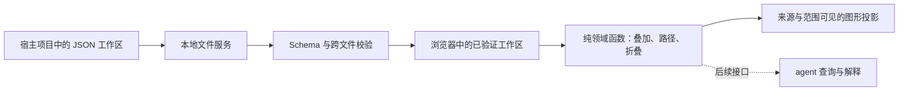

# 游戏规则分析工具架构设计

状态：2026-08-31 已实现本地 CLI、工作区 v3、独立视图文件、网页编辑器和节点名词表。视图自动写回、最新源图打开、失败保留草稿已通过隔离验证；公开注册表发布与 agent 优化仍未完成。

## 问题、边界与不变量

工具为设计者和 agent 提供可追踪的规则模型。它独立于游戏引擎、资产编译器与宿主编辑器，用同一协议分析不同游戏。工具仓库保存通用程序、Schema、文档与虚构示例；具体游戏的工作区文件保存在游戏项目中。宿主通过 Git 子模块固定工具版本，不把分析数据搬入子模块。

因果边表达抽象规则层的促进/抑制。敌人产出近战、某行动抑制近战，即建立机制抑制关系，不需要实例绑定或检查某局行动可用性。路径符号不等于净效果或胜率。单入单出节点可折叠为摘要，但必须能展开回原始节点、边、说明及来源。叠加无覆盖优先级、无自动正负抵消、无按名称合并；当前缺边不代表实际规则中不存在关系。

统一节点定义图是每个工作区唯一的概念来源；基础规则与关卡的因果边仍归各分析图。概念表显示全部共享定义，分析图画布呈现所选图层的节点和边。无分析关系的定义节点不是坏设计。

## 新增或改变的概念、唯一 owner 与数据流

| 事实 | 唯一 owner | 消费者 |
| --- | --- | --- |
| 文件结构与枚举 | `schemas/protocol.schema.json` | AJV、文档作者、编辑器保存门禁 |
| 节点定义、增加方向、默认布局 | `definitions.graph.json` | 所有分析图、定义总览 |
| 基础/局面因果边、条件、局部布局 | 对应 `.analysis.json` | 组合、路径与疑点计算 |
| 命名叠加选择、编辑层、折叠与观察位置 | 对应 `.view.json` | 最新源图投影；不拥有规则 |
| 工作区身份、唯一定义入口、保存的组合 | `workspace.json` | 文件服务、浏览器导航 |
| 分析文件成员与目录结构 | 工作区磁盘目录；服务生成内存 `files` 映射 | 保存服务、文件侧栏 |
| 重复 ID、工作区一致性、引用校验 | `src/domain/validate.mjs` | 文件读写门禁 |
| 叠加、路径、折叠、疑点 | `src/domain/graph.mjs` | 浏览器与未来 agent 接口 |
| 授权目录、字节读取、版本戳 | `src/server/workspace.mjs` | 本地 HTTP、CLI、保存服务 |
| 单工作区锁、队列、原子替换与回读 | `src/server/store.mjs` | HTTP 保存与新建接口 |
| 根定位、初始化、显式迁移 | `src/server/workspace-commands.mjs` | CLI；网页不能切换授权根 |
| 完整文件提交和锁文件 | `src/server/files.mjs` | 保存服务与迁移器 |
| 会话授权、同源边界、接口路由 | `src/server/http.mjs` | 浏览器 |
| 草稿、编辑图层、可见层与保存流程 | `src/web/app.mjs` | 页面；以服务回读确认保存 |
| 视图打开候选、目标快照、失败暂停 | `src/web/view-files.mjs` | app 共享写入队列，不自建第二队列 |
| SVG 投影、相机与拖拽手势 | `src/web/canvas.mjs` | 页面；不拥有持久化事实 |
| 概念表格、搜索和行内输入 | `src/web/glossary.mjs` | 编辑 app 持有的定义草稿，不单独保存 |

`src/domain/graph.mjs` 是纯函数模块，可直接在浏览器或 Node 中运行。文档结构校验使用 AJV，跨文件验证集中在同一入口，不在 UI 再造一套事实模型。`src/web/` 当前采用原生 ES 模块与 SVG；后续可更换交互框架或图形库，但不得让组件状态成为独立规则源。

CLI 显式 `--workspace` 优先；省略时向上寻找最近标记。根 realpath 在启动时固定，不随 cwd 改变。工作区 v3 递归发现普通 `*.analysis.json` 和 `*.view.json`，身份和定义入口仍由 manifest 拥有。每次读取重建 `{kind,id?,path}` 映射，不持久化第二份清单；分析和视图分别有 ID 命名空间，保存按 `(kind,id)` 查路径。任何坏文件或断引用均整体失败，不返回部分成功或默认示例。

每个分析文件对应一个 Layer。可见集合与当前编辑层分离；其他层的边只供参考，折叠摘要不可编辑。顶部概念表是共享定义的唯一编辑入口，分析图编辑引用、关系及局部布局。表格借鉴 SJE Array 的视觉方式，不导入 SJE。侧栏按真实目录混排分析和视图文件，不另建虚拟组合分类；视图行只可打开、不可勾选。「新建分析图」「新增概念」「引用概念」「保存为视图」分别创建规则文件、定义、引用和观察文件。

页面只持有一份当前规则草稿；切换前要求保存、放弃或取消。工作视图与记住的分析层分别管理，保存种类由工作视图决定，不把定义草稿写入分析文件。规则内容手动保存；命名视图的选择自动写回 `.view.json`，未命名浏览自动写到 manifest 的内联 lastView。命名视图的 lastView 只存 `{viewId}`，禁止第二份选择快照。历史 compositions 保留但不镜像、不自动转文件。视图不保存相机或顶部工作视图。

打开视图始终重新 GET 完整工作区，包括重复打开同一 ID。先验证候选叠加、折叠，再写最近打开记录，全部确认后才替换 UI 与规则草稿。失败保持原画面并明确标记未刷新；“放弃”决定延后至目标成功时生效。命名视图变化捕获明确的文件目标和快照，与规则写入共用队列；首次失败立即暂停后续自动写入，分开显示规则与视图状态，允许导出两类草稿。不采用外部新 revision 偷偷重试。

## 推荐决策、关键理由与一个关键失败路径

### 本地文件优先

采用 Node.js 24+、同源浏览器、本地 UTF-8 JSON。没有云数据库、浏览器私有数据库或宿主专用 host。本地服务器只绑定 `127.0.0.1`，随机会话 token 仅在启动网址片段及页面内存中存在，不进入工作区。API 校验 Host、Origin 与会话 token；不开放宽泛 CORS，不接受任意文件路径，不执行规则文本。

文件读取限定到固定根，逐层拒绝内部符号链接/junction，拒绝绝对路径、`..`、重复路径、嵌套工作区和无效引用。隐藏条目与 node_modules 排除；其他普通 JSON 不作为图解析。静态资源按白名单提供，不开放目录；单文件上限 2 MiB、分析图/视图各 300 张、目录深度 24、可见目录项 10000。此边界针对浏览器越权和误操作，不防御同权限恶意本机进程。

JSON Schema 采用 draft-07，由 AJV 严格校验，不开启类型转换、默认填充或删除额外字段；协议版本与 JSON Schema 草案版本是两个不同概念。[AJV 对 Schema 草案的支持](https://ajv.js.org/json-schema.html#draft-07-default)

### 保存必须另过门禁

保存服务使用工作区单写进程锁、串行队列、整体 revision 比较、候选工作区引用校验、同目录临时文件及原子替换、回读确认。定义删除检查全部持久化图，不仅当前显示的图。会话同时支持多标签页，但旧 revision 必须拒绝。

本机锁通过独占创建 `.rule-analyzer.lock` 获取；第二服务启动失败，正常关闭释放锁。异常退出后不自动抢锁，需人工确认没有写入者再清理。一次操作失败只终止该请求，不隐式重试；后续独立请求仍可进入队列。

新建图以同目录完整临时文件加硬链接发布，原子拒绝同名目标；不再另改 manifest。文件完整出现即属于目录发现集合。创建父目录后失败可能留下空目录，须报告目标与失败；不支持硬链接的文件系统明确失败。已有文件以 rename 替换；提交后回读或响应失败返回“结果待确认”，不能声称没写入或自动重放。

创建视图文件和更新最近打开是两次提交；前者成功、后者失败时报告已创建路径并要求重读，不能假称整体回滚、自动重建或删除。视图与分析图采用同一受限提交机制，只把种类、后缀和文档集合参数化。

安装包的 bin、静态资源和 Schema 相对模块地址定位，与资料目录分离；保留 private:true，不执行公开发布。显式 CLI 迁移 v1/v2 到 v3：v1 检查登记集合一致，v2 保留目录发现；两者验证旧资料、候选 v3 和潜在视图文件，通过锁与 revision 后备份原 manifest。只更新配置版本，并在 v1 移除旧清单；图和定义字节、历史组合与内联 lastView 不变，不生成视图文件。有效 v3 重复迁移不写入。详见 [CLI 与工作区](CLI与工作区.md)。

整体 revision 能发现读取之后已经完成的外部修改，但不提供对任意外部编辑器的原子 compare-and-swap。当前读取也不是多文件事务快照，读取期间应避免其他程序改写工作区。写入限于本地磁盘，不默认承诺掉电恢复、网络共享盘或多人协作。[Node 文件系统并发说明](https://nodejs.org/api/fs.html#promises-api)

### 关键失败路径

页面 A 修改节点定义后，页面 B 仍拿旧 revision 保存引用该节点的分析图。服务先拒绝旧版本，再由 B 重新加载差异；即使 B 换用新 revision，若引用已经失效，整体校验仍必须拒绝。页面保留草稿，但不得按名称重建节点、丢弃断边或直接覆盖他人修改。浏览器与文件测试已经验证旧版本拒绝、其他层字节不变和草稿保留所依赖的服务合同。

## 最小实施切片、验证与关键引用

`npm run check` 执行语法检查、示例校验及 38 项测试：图语义、HTTP/文件边界、锁、revision、文件隔离、移动、稳定根、迁移，以及视图同 ID 分区、断引用、最新打开、创建部分完成、响应丢失和队列暂停。`npm run check:package` 实际安装 tarball，验证 Windows shim、仓库外 CLI 启动和包含视图模块的静态资源；尚未在其他 OS 实测。

0.3.0 隔离浏览器验证创建视图、自动保存勾选/编辑层/折叠、重开恢复、源图最新名称、外部版本冲突暂停和取消保留视图草稿；缺失源图时，即使已选择放弃，目标打开失败仍保留原规则草稿和画面。视图自动保存未改变源分析字节。正式工作区不用于浏览器测试。

浏览器验收使用隔离示例目录。前次验证画布新建与改名、节点引用、正负边、说明保存、拖拽、图层与组合，以及名词表必填、引用删除保护和外部文件发现。0.2.1 验证全局切换、取消保留草稿、定义保存不改三份分析图、图层/折叠保留、引用跳转、历史组合不变、隐藏全部图层、空工作区新增概念与中文嵌套目录首张图、保存后刷新恢复。未做掉电或磁盘故障注入、大图表格性能及所有平台验收。

自动布局、复杂多文件重构、多人协作与 agent 查询接口不在当前完成态。实时状态、可执行条件、实例绑定与战斗规划不属于本工具当前目标，不能作为证明抽象反制关系的前置条件。后续按[开发路线](开发路线.md)逐片验证；不因为设计文档描述了能力就把它标为通过。

本仓库独立验证不调用宿主游戏测试。Git 子模块有独立历史，宿主记录具体提交；协作方需要能访问该提交后，父仓库指针才可复现。[Git 子模块模型](https://git-scm.com/docs/gitsubmodules)

相关合同：[需求与范围](需求与范围.md)、[文件协议](文件协议.md)、[模型对 agent 的价值与优化讨论](模型对agent的价值与优化讨论.md)。
