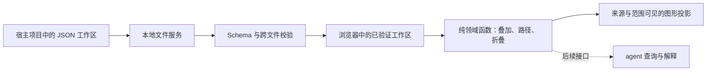

# 游戏规则分析工具架构设计

状态：2026-08-31 已实现本地网页编辑器。文件读写、Layer 编辑归属、最近视图记忆与画布交互已有验证；agent 优化建议仍是后续工作。

## 问题、边界与不变量

工具为设计者和 agent 提供可追踪的规则模型。它独立于游戏引擎、资产编译器与宿主编辑器，用同一协议分析不同游戏。工具仓库保存通用程序、Schema、文档与虚构示例；具体游戏的工作区文件保存在游戏项目中。宿主通过 Git 子模块固定工具版本，不把分析数据搬入子模块。

因果边表达抽象规则层的促进/抑制。敌人产出近战、某行动抑制近战，即建立机制抑制关系，不需要实例绑定或检查某局行动可用性。路径符号不等于净效果或胜率。单入单出节点可折叠为摘要，但必须能展开回原始节点、边、说明及来源。叠加无覆盖优先级、无自动正负抵消、无按名称合并；当前缺边不代表实际规则中不存在关系。

统一节点定义图是每个工作区唯一的概念来源；基础规则与关卡的因果边仍归各分析图。定义图页面可显示全部概念，并投影选定分析图的边，因此既能浏览“有哪些概念”，又不重复持有基础规则。无分析关系的定义节点不是坏设计。

## 新增或改变的概念、唯一 owner 与数据流

| 事实 | 唯一 owner | 消费者 |
| --- | --- | --- |
| 文件结构与枚举 | `schemas/protocol.schema.json` | AJV、文档作者、编辑器保存门禁 |
| 节点定义、增加方向、默认布局 | `definitions.graph.json` | 所有分析图、定义总览 |
| 基础/局面因果边、条件、局部布局 | 对应 `.analysis.json` | 组合、路径与疑点计算 |
| 工作区文件清单、保存的组合 | `workspace.json` | 文件服务、浏览器导航 |
| 重复 ID、工作区一致性、引用校验 | `src/domain/validate.mjs` | 文件读写门禁 |
| 叠加、路径、折叠、疑点 | `src/domain/graph.mjs` | 浏览器与未来 agent 接口 |
| 授权目录、字节读取、版本戳 | `src/server/workspace.mjs` | 本地 HTTP、CLI、保存服务 |
| 单工作区锁、队列、原子替换与回读 | `src/server/store.mjs` | HTTP 保存与新建接口 |
| 会话授权、同源边界、接口路由 | `src/server/http.mjs` | 浏览器 |
| 草稿、编辑图层、可见层与保存流程 | `src/web/app.mjs` | 页面；以服务回读确认保存 |
| SVG 投影、相机与拖拽手势 | `src/web/canvas.mjs` | 页面；不拥有持久化事实 |

`src/domain/graph.mjs` 是纯函数模块，可直接在浏览器或 Node 中运行。文档结构校验使用 AJV，跨文件验证集中在同一入口，不在 UI 再造一套事实模型。`src/web/` 当前采用原生 ES 模块与 SVG；后续可更换交互框架或图形库，但不得让组件状态成为独立规则源。

CLI 必须显式传入 `--workspace`；服务按 manifest 读取，不扫描猜测未登记文件。浏览器拿到完整且通过校验的工作区后进行组合操作；任何加载失败都显示错误，不返回残缺成功或切换成默认示例。

每个分析文件对应一个 Layer。可见图层集合与当前编辑层分离；写入接口按明确的文档种类与图 ID 查找登记文件。其他可见层的边只供参考，折叠摘要不可编辑。定义图编辑共享概念和默认布局，分析层编辑引用、关系及局部布局。

页面只持有一个文件草稿；切换前要求保存、放弃或取消。规则内容手动保存，视图选择自动保存到 manifest 的可选 `lastView`。命名组合与最近视图都引用源图 ID，重开时读取最新源文档，不冻结合并图快照。最近视图包含可见层、编辑层、折叠和组合位置，不持久化相机缩放。

## 推荐决策、关键理由与一个关键失败路径

### 本地文件优先

采用 Node.js 24+、同源浏览器、本地 UTF-8 JSON。没有云数据库、浏览器私有数据库或宿主专用 host。本地服务器只绑定 `127.0.0.1`，随机会话 token 仅在启动网址片段及页面内存中存在，不进入工作区。API 校验 Host、Origin 与会话 token；不开放宽泛 CORS，不接受任意文件路径，不执行规则文本。

文件读取限定到显式工作区，逐层拒绝内部符号链接/junction，拒绝绝对路径、`..`、重复路径和无效引用。静态资源按白名单提供；不把整个源码仓库或分析目录当作静态服务器根目录。单文件上限 2 MiB，分析图上限 300。此安全边界针对浏览器越权和误操作，不防御同一用户权限下的恶意本机进程。

JSON Schema 采用 draft-07，由 AJV 严格校验，不开启类型转换、默认填充或删除额外字段；协议版本与 JSON Schema 草案版本是两个不同概念。[AJV 对 Schema 草案的支持](https://ajv.js.org/json-schema.html#draft-07-default)

### 保存必须另过门禁

保存服务使用工作区单写进程锁、串行队列、整体 revision 比较、候选工作区引用校验、同目录临时文件及原子替换、回读确认。定义删除检查全部持久化图，不仅当前显示的图。会话同时支持多标签页，但旧 revision 必须拒绝。

本机锁通过独占创建 `.rule-analyzer.lock` 获取；第二服务启动失败，正常关闭释放锁。异常退出后不自动抢锁，需人工确认没有写入者再清理。一次操作失败只终止该请求，不隐式重试；后续独立请求仍可进入队列。

新建图的文件创建和 manifest 登记是两个步骤，不能宣称多文件原子事务。先创建完整文件再登记；登记失败必须报告未完成，留下的未登记文件不能偷偷扫描入库。提交前失败保证旧目标不变；替换已完成而响应失败时返回“结果待确认”，不能声称没写入，也不能自动重放。

整体 revision 能发现读取之后已经完成的外部修改，但不提供对任意外部编辑器的原子 compare-and-swap。当前读取也不是多文件事务快照，读取期间应避免其他程序改写工作区。写入限于本地磁盘，不默认承诺掉电恢复、网络共享盘或多人协作。[Node 文件系统并发说明](https://nodejs.org/api/fs.html#promises-api)

### 关键失败路径

页面 A 修改节点定义后，页面 B 仍拿旧 revision 保存引用该节点的分析图。服务先拒绝旧版本，再由 B 重新加载差异；即使 B 换用新 revision，若引用已经失效，整体校验仍必须拒绝。页面保留草稿，但不得按名称重建节点、丢弃断边或直接覆盖他人修改。浏览器与文件测试已经验证旧版本拒绝、其他层字节不变和草稿保留所依赖的服务合同。

## 最小实施切片、验证与关键引用

已交付文件协议、引用校验、纯图函数、本地受限读写、极简节点编辑器、独立仓库和示例。`npm run check` 执行语法检查、示例校验及 18 项行为测试；覆盖正负路径、异号边并存、同名异 ID、不可折叠环、文件引用、路径越界、会话门禁、锁、版本冲突、创建登记、图层隔离和最近视图读取最新源内容。

真实浏览器验收使用隔离示例目录，验证了共享定义新建与改名、引用节点、正负连线、说明文字保存、节点拖拽、图层开关、指定编辑层、命名组合及刷新恢复。未通过掉电或磁盘故障注入测试，不把代码中的失败处理当成所有环境均已验证。

自动布局、复杂多文件重构、多人协作与 agent 查询接口不在当前完成态。实时状态、可执行条件、实例绑定与战斗规划不属于本工具当前目标，不能作为证明抽象反制关系的前置条件。后续按[开发路线](开发路线.md)逐片验证；不因为设计文档描述了能力就把它标为通过。

本仓库独立验证不调用宿主游戏测试。Git 子模块有独立历史，宿主记录具体提交；协作方需要能访问该提交后，父仓库指针才可复现。[Git 子模块模型](https://git-scm.com/docs/gitsubmodules)

相关合同：[需求与范围](需求与范围.md)、[文件协议](文件协议.md)、[模型对 agent 的价值与优化讨论](模型对agent的价值与优化讨论.md)。
